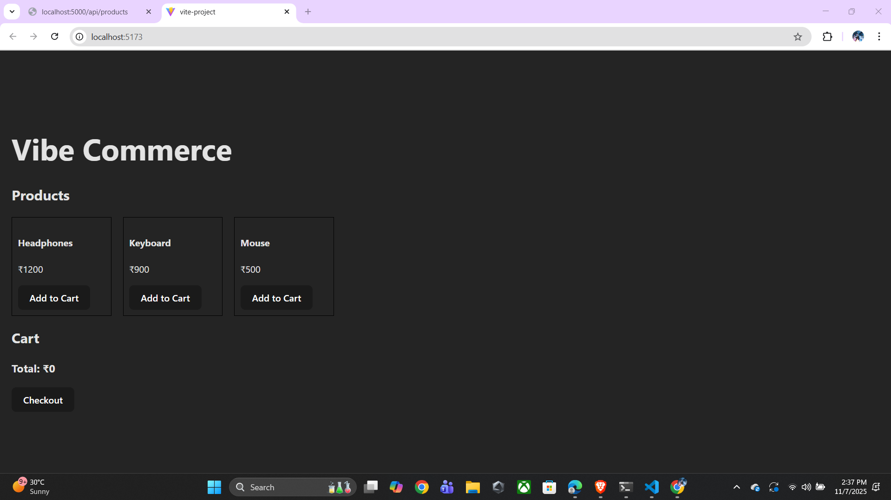

# Vibe Commerce — Mock E-Commerce Cart

A simple full-stack shopping cart app built for Vibe Commerce internship screening.  
Handles adding/removing items, cart totals, and mock checkout.  

## Tech Stack

- **Frontend:** React, Axios  
- **Backend:** Node.js, Express  
- **Database:** JSON file (mock persistence, can swap with MongoDB)  
- **API Style:** REST  

## Features

- **Products Grid:** Display 5-10 products with price  
- **Add to Cart:** Add products with quantity  
- **Cart View:** See items, total price, remove items  
- **Checkout:** Mock checkout with receipt (total, timestamp)  
- **Responsive Design:** Works on desktop & mobile  

## Folder Structure

vibe-commerce/
├─ backend/
│ ├─ server.js # Express server & APIs
│ ├─ data.js # JSON DB loader/saver
│ └─ db.json # Mock DB
├─ frontend/
│ ├─ src/
│ │ └─ App.js # React frontend
│ └─ package.json
└─ .gitignore


## How to Run Locally

### Backend
```bash
cd backend
npm install
node server.js
Runs on http://localhost:5000

### Frontend
cd frontend
npm install
npm run dev
Runs on http://localhost:3000

## Demo / Screenshots

### 1. Products Grid


### 2. Cart View


### 3. Checkout


**Video Demo:** [Click here]()
